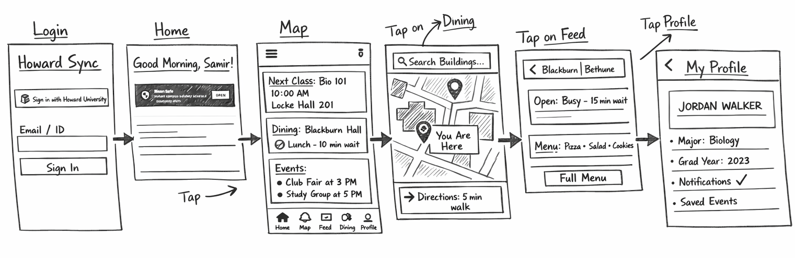
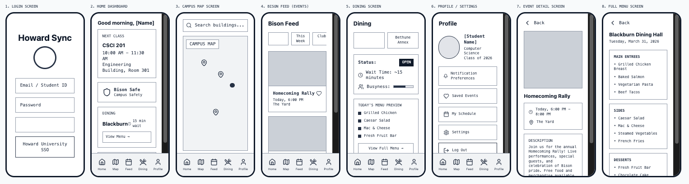
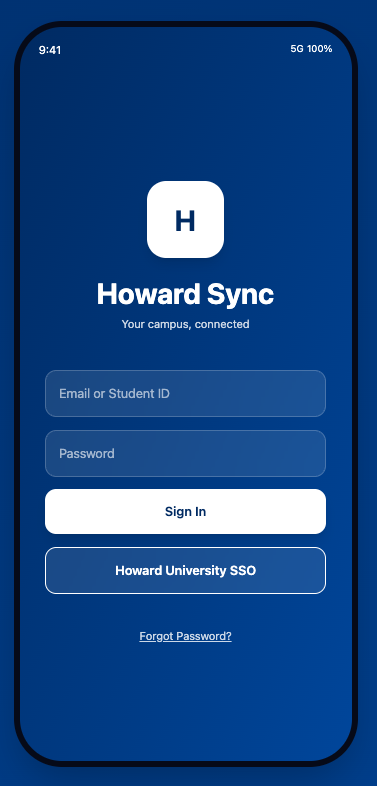
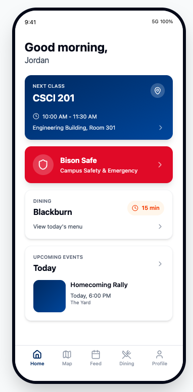
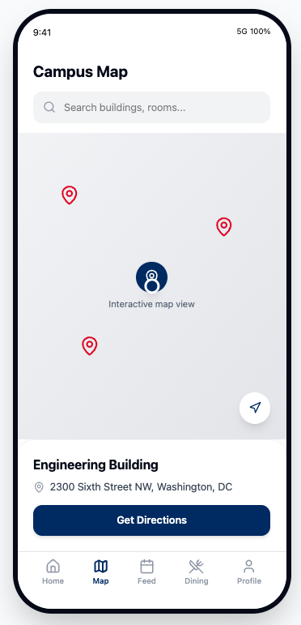
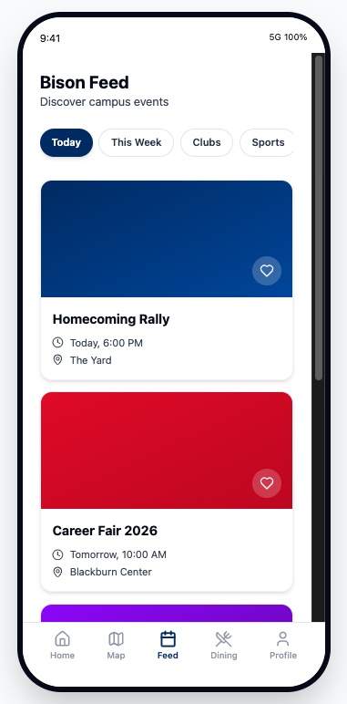
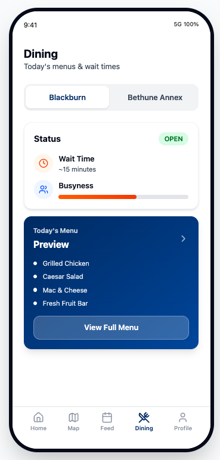
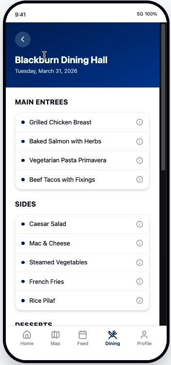
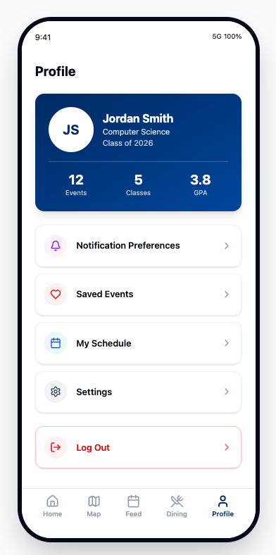

# Howard Sync 🦬

## Table of Contents
1. [Overview](#Overview)
2. [Product Spec](#Product-Spec)
3. [Wireframes](#Wireframes)
4. [Schema](#Schema)

---

## Overview
### Description
**Howard Sync** is a centralized mobile ecosystem designed specifically for Howard University students. It consolidates fragmented campus resources—academic schedules, real-time dining data, indoor navigation, and student organization feeds—into a single, intuitive interface. The goal is to reduce "administrative friction" and foster a stronger, more connected campus community.

### App Evaluation
* **Category:** Education / Social / Productivity
* **Mobile:** Mobile-first design utilizing GPS for navigation, push notifications for safety alerts, and camera integration for QR/ID scanning.
* **Story:** Solves the "First-Week Confusion" and the "Information Gap" by providing a reliable, all-in-one source for campus life that physical maps and scattered emails often fail to provide.
* **Market:** Primarily the 12,000+ Howard University student body; secondary market includes faculty and staff.
* **Habit:** High frequency (Daily). Students check the app for class locations, dining menus, and safety features throughout the day.
* **Scope:** Broad in utility but narrow in focus (HU-specific). It starts as a resource hub with potential to scale into a full social networking platform for Bison.

---

## Product Spec

### 1. User Stories (Required and Optional)

**Required Must-have Stories**
* [ ] User can log in via Howard University credentials (SSO).
* [ ] User can view their daily class schedule and room numbers.
* [ ] User can view a campus map with real-time location tracking (GPS).
* [ ] User can view daily dining menus and estimated wait times for Blackburn and Bethune Annex.
* [ ] User can browse a feed of upcoming campus events and organization meetings.
* [ ] User can access "Bison Safe" emergency buttons for campus security.

**Optional Nice-to-have Stories**
* [ ] User can "Check-in" to study spots to show friends where they are.
* [ ] User can receive push notifications when their favorite meal is served.
* [ ] AI-powered chatbot to answer FAQs (e.g., "Where is the financial aid office?").
* [ ] Integration with laundry room timers to see available machines.

### 2. Screen Archetypes
* **Login Screen**
    * User can log in using their university email/ID.
* **Home Dashboard**
    * User can see a summary of their next class, current dining menu highlights, and trending events.
* **Campus Map Screen**
    * User can search for buildings (e.g., Locke Hall) and see their live GPS position.
* **Bison Feed (Events)**
    * User can scroll through a list of events and "heart" them to save to their calendar.
* **Dining Screen**
    * User can toggle between different dining halls to see menus and "busy-ness" meters.
* **Profile/Settings Screen**
    * User can edit their major, graduation year, and notification preferences.

### 3. Navigation

**Tab Navigation (Tab to Screen)**
* **Home:** Overview of the user's day.
* **Map:** Campus navigation and building directory.
* **Feed:** Campus-wide events and organization updates.
* **Dining:** Menus and wait times.
* **Profile:** User settings and personal saved events.

**Flow Navigation (Screen to Screen)**
* **Login Screen** -> Home Dashboard
* **Home Dashboard** -> Map Screen (when tapping a class location)
* **Home Dashboard** -> Dining Screen (when tapping "See Full Menu")
* **Bison Feed Screen** -> Event Detail View
* **Dining Screen** -> Nutritional Info/Expanded Menu

---

## Wireframes

### Low-Fidelity Sketch

### Iterated Wireframe

*(Note: The above image combines all wireframe screens. To view the 8 individual low-fidelity wireframe screens, please check the [individual-wireframes](assets/wireframes/low-fidelity/individual-wireframes/) folder.)*

#### Navigation Flow
- **Login** → Home Dashboard  
- **Home** (class card) → Campus Map  
- **Home** (dining preview) → Dining Screen  
- **Bison Feed** → Event Detail  
- **Dining** → Full Menu Screen  
- **Bottom Tab Navigation:** Home ↔ Map ↔ Feed ↔ Dining ↔ Profile

### Digital Wireframes

### Interactive Prototype Video

---

## Schema 

### Models
| Property      | Type     | Description |
| ------------- | -------- | ----------- |
| `userId`      | String   | Unique id for the user (HU ID) |
| `userName`    | String   | Student's full name |
| `userMajor`   | String   | Student's academic major |
| `eventTitle`  | String   | Name of the campus event |
| `eventTime`   | DateTime | Date and time of the event |
| `location`    | GeoPoint | GPS coordinates for map pinning |

### Networking
* **Home Screen**
    * (Read/GET) Query logged-in user's class schedule.
    * (Read/GET) Fetch current daily menu from Dining API.
* **Feed Screen**
    * (Read/GET) Fetch all upcoming events.
    * (Create/POST) Allow Student Orgs to post new events.
